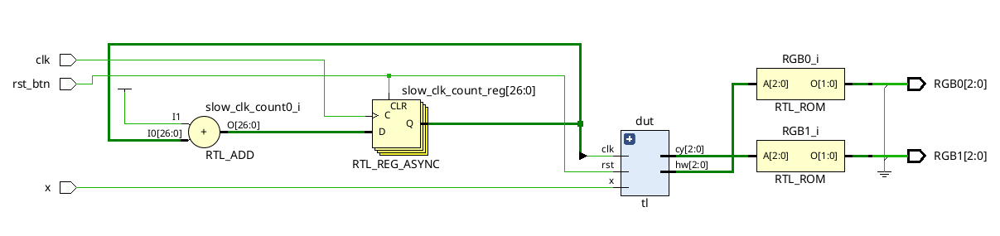

# Smart Traffic Light Controller

## What this does
An FSM-based traffic light controller for a highway and country road intersection where the highway remains green by default and the country road is granted right-of-way only when a vehicle is detected by a sensor.

## Files
| File | Description |
|------|-------------|
| traffic_light_controller.v | RTL source implementing the FSM and programmable delay counters |
| traffic_light_controller_tb.v | Testbench for functional verification |
| top.xdc | FPGA pin constraints |
| waveform.png | Simulation waveform |
| synthesis_report.png | Vivado utilization and timing report |
| top.bit | Generated FPGA bitstream |

## Simulation result

## Synthesis (Xilinx Vivado)
| Resource | Used |
|----------|------|
| LUT | 34 |
| FF | 36 |
| Fmax | Unconstrained |

## Video Demo

## What I learned
- Learned how to model a real-world control system as a finite state machine with sensor-driven transitions.
- Implemented programmable delays between selected states using counter-based timing logic.
- Completed the full FPGA development flow, including RTL design, simulation, synthesis, implementation, bitstream generation, and successful hardware validation on the Spartan-7 board.

## Tools
Xilinx Vivado · Xilinx Hardware Manager · Spartan-7 FPGA Board