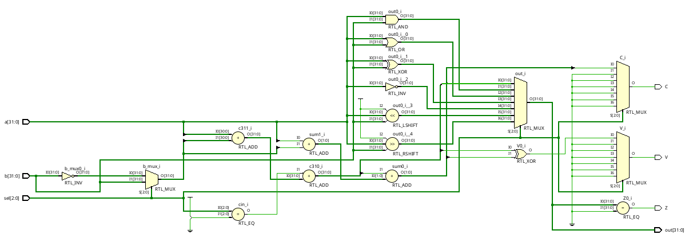
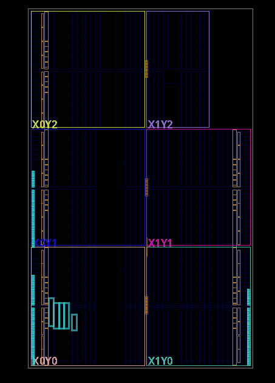

# 32-Bit ALU

## What this does
A 32-bit combinational Arithmetic Logic Unit (ALU) that performs arithmetic, logical, and shift operations. The design generates status flags including zero, carry, and overflow, and was synthesized, implemented, and programmed onto the Spartan-7 FPGA.

## Files
| File | Description |
|------|-------------|
| alu.v | RTL source implementing the 32-bit ALU |
| alu_tb.v | Testbench for functional verification |
| top.xdc | FPGA pin constraints |
| waveform.png | Simulation waveform |
| synthesis_report.png | Vivado utilization and timing report |
| top.bit | Generated FPGA bitstream |

## Schematic Design

## Synthesis (Xilinx Vivado)
| Resource | Used |
|----------|------|
| LUT | 290 |
| FF | 0 |
| CARRY4 | 8 |
| DSP | 0 |
| BRAM | 0 |
| Fmax | Unconstrained |

## Implemented Design

## What I learned
- Designed a 32-bit combinational ALU in Verilog HDL.
- Implemented arithmetic, logical, and shift operations using a case-based architecture.
- Generated zero, carry, and overflow flags.
- Observed how Vivado maps arithmetic operations to dedicated CARRY4 resources.
- Completed the full FPGA development flow, including RTL design, simulation, synthesis, implementation, bitstream generation, and successful hardware validation on the Spartan-7 board.

## Tools
Xilinx Vivado · Xilinx Hardware Manager · Spartan-7 FPGA Board