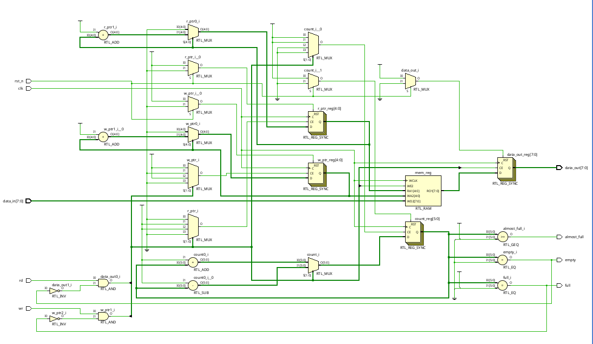
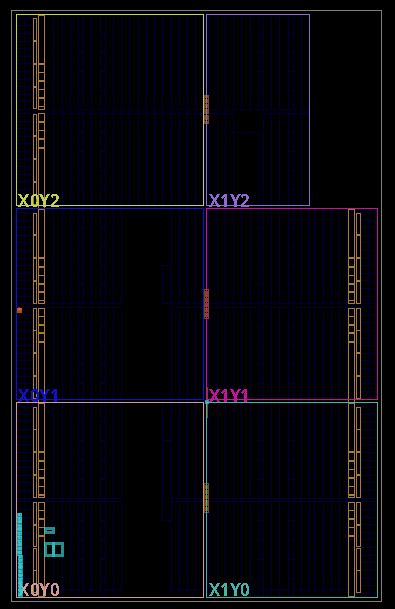

# Synchronous FIFO

## What this does
A parameterized Synchronous FIFO (First-In First-Out) memory implemented in Verilog HDL. The design supports controlled read and write operations using a single clock domain while generating status signals such as `full` and `empty`. The FIFO internally uses memory arrays along with read and write pointers to manage data flow efficiently.

## Files
| File | Description |
|------|-------------|
| fifo.v | RTL source implementing the synchronous FIFO |
| tb_fifo.v | Testbench for functional verification |
| timing_report.txt | Vivado synthesis and timing report |
| netlist.v | Synthesized gate-level netlist |
| waveform.png | Simulation waveform |
| fifo_utilization_synth.rpt | FPGA resource utilization report |

## Schematic Design

## Synthesis
| Resource | Used |
|----------|------|
| LUTs | 34 |
| Flip-Flops (FDRE) | 29 |
| Distributed RAM | RAM32M × 1, RAM32X1D × 2 |
| BRAM | 0 |
| DSP | 0 |
| FIFO Memory Size | 32 × 8 |
| Target FPGA | Xilinx Spartan-7 (xc7s50csga324-1) |

## Timing Report
| Metric | Value |
|------|------|
| Synthesis Status | Timing Optimized |
| Errors | 0 |
| Warnings | 1 |
| Critical Warnings | 1 |
| Clock Constraint | Missing/Invalid XDC clock port |
| Timing Result | Synthesis completed successfully |

## Implemented Design

## FIFO Features
- Parameterized FIFO depth and data width
- Single clock synchronous operation
- Supports simultaneous read and write
- Full and empty flag generation
- Pointer-based memory management
- Efficient distributed RAM inference during synthesis

## What I learned
- Designed a synchronous FIFO using Verilog HDL.
- Implemented circular buffer memory architecture.
- Understood read/write pointer handling.
- Generated and verified `full` and `empty` conditions.
- Learned how distributed RAM is inferred during FPGA synthesis.
- Performed functional verification using a Verilog testbench.
- Analyzed synthesis and utilization reports in Vivado.
- Explored FPGA resource mapping and optimization flow.

## Tools
Verilog HDL · Vivado · GTKWave · Xilinx Spartan-7 FPGA